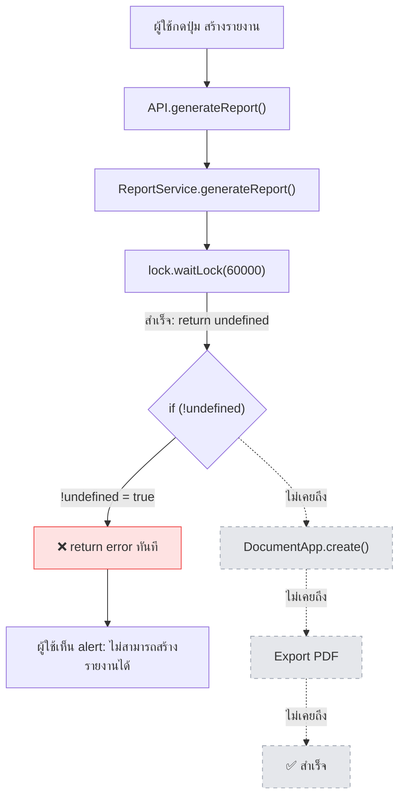

# 🔍 Root Cause Analysis — Report Builder ไม่สร้างเอกสาร

## สรุปปัญหา

Report Builder **ไม่เคยเข้าถึงขั้นตอนการสร้างเอกสารจริงเลย** ทุกครั้งที่กดสร้างรายงาน ระบบจะ return ข้อความ error ออกไปทันที

---

## 🐛 Root Cause: ใช้ `waitLock()` ผิดวิธี

### จุดที่เกิดปัญหา

[ReportService.gs บรรทัด 19-23](file:///h:/06-Projects/Hongson-Information/apps-script/ReportService.gs#L19-L23):

```javascript
var lock = LockService.getScriptLock();
try {
  if (!lock.waitLock(60000)) {   // ← 🐛 BUG อยู่ตรงนี้
    return { success: false, message: "ระบบกำลังสร้างรายงาน..." };
  }
```

### ทำไมถึง Bug?

ตามเอกสาร Google Apps Script อย่างเป็นทางการ `Lock` class มี 2 method ที่ทำงานต่างกันอย่างสิ้นเชิง:

| Method | Return Type | เมื่อสำเร็จ | เมื่อ Timeout |
|--------|-------------|-------------|---------------|
| `tryLock(ms)` | **Boolean** | คืนค่า `true` | คืนค่า `false` |
| `waitLock(ms)` | **void** | คืนค่า `undefined` | **Throw Exception** |

โค้ดปัจจุบันใช้ `waitLock()` แต่ตรวจสอบค่า return เหมือนใช้ `tryLock()` ส่งผลดังนี้:

### ลำดับการทำงานที่เกิดขึ้นจริง

```
1. lock.waitLock(60000) ← สำเร็จ! ได้ Lock แล้ว
2. waitLock() คืนค่า → undefined (เพราะ return type คือ void)
3. if (!undefined) → if (true) → เข้าเงื่อนไข!
4. return { success: false, message: "ระบบกำลังสร้างรายงาน..." }
   ↑ ส่งข้อผิดพลาดกลับทันที โดยไม่เคยเริ่มสร้างเอกสาร!
5. finally → lock.releaseLock() ← คืน Lock กลับ
```

> [!CAUTION]
> **ทุกครั้ง** ที่เรียก `generateReport` ระบบจะ return error ทันทีที่บรรทัด 22 โดยไม่เคยลงไปถึงขั้นตอนสร้าง Google Docs (บรรทัด 45) หรือ Export PDF (บรรทัด 121) เลย

---

## ผลกระทบที่เกิดขึ้น



---

## ✅ แนวทางแก้ไข (2 ทางเลือก)

### ทางเลือก A: เปลี่ยนจาก `waitLock()` เป็น `tryLock()` (แนะนำ)

เปลี่ยนให้ใช้ `tryLock()` ซึ่งคืนค่า boolean ตรงกับ logic เดิมที่โค้ดตั้งใจไว้:

```diff
  var lock = LockService.getScriptLock();
  try {
-   if (!lock.waitLock(60000)) {
+   if (!lock.tryLock(60000)) {
      return { success: false, message: "..." };
    }
```

> [!TIP]
> **ทางเลือก A** เป็นวิธีที่แก้ไขน้อยที่สุด (เปลี่ยนแค่ชื่อ method) และรักษา logic ป้องกันการสร้างรายงานซ้อนไว้ครบถ้วน

---

### ทางเลือก B: ใช้ `waitLock()` อย่างถูกต้อง (ไม่ตรวจ return value)

ใช้ `waitLock()` ตาม pattern มาตรฐานของ Google โดยให้ Exception handling จัดการกรณี Timeout:

```diff
  var lock = LockService.getScriptLock();
  try {
-   if (!lock.waitLock(60000)) {
-     return { success: false, message: "..." };
-   }
+   lock.waitLock(60000);
    
    var ss = SheetService.getSpreadsheet();
    // ... ดำเนินการสร้างเอกสารต่อ ...
    
  } catch (err) {
+   // จะจับทั้ง LockTimeout และ error อื่นๆ ที่เกิดระหว่างสร้างรายงาน
    Logger.log("Report generation failed: " + err.toString());
    return { success: false, message: "เกิดข้อผิดพลาด: " + err.toString() };
  } finally {
    lock.releaseLock();
  }
```

---

## ข้อสังเกตเพิ่มเติม

- **ไฟล์ใน Google Drive เป็นหลักฐานยืนยัน:** การที่ไม่พบไฟล์ Google Docs หรือ PDF ใน Drive Folder ยืนยันว่าโค้ดไม่เคยทำงานถึงบรรทัด `DocumentApp.create()` (บรรทัด 45)
- **ข้อความ alert ที่เห็น** "ไม่สามารถสร้างรายงานได้: ระบบกำลังสร้างรายงานโดยผู้ใช้อื่น..." มาจาก [admin.js บรรทัด 912](file:///h:/06-Projects/Hongson-Information/assets/js/admin.js#L912) ซึ่งนำข้อความจาก `res.message` มาแสดง
- **การที่ "รอนานมาก"** เกิดจากที่เราเพิ่ม timeout เป็น 60 วินาทีในรอบก่อนหน้า ถึงแม้ `waitLock()` จะ return undefined ทันที แต่ฝั่ง frontend มี progress animation ที่ค่อยๆ เพิ่ม % ทุก 1.5 วินาที ทำให้ดูเหมือนรอนาน

---

## คำแนะนำ

> [!IMPORTANT]
> ผมแนะนำ **ทางเลือก A** (`tryLock`) เนื่องจากเปลี่ยนแค่ชื่อ method เพียงจุดเดียว ไม่ต้องปรับโครงสร้าง try-catch ใหม่ และรักษาพฤติกรรมป้องกัน concurrent access ไว้เหมือนเดิม

กรุณา Approve เพื่อดำเนินการแก้ไขครับ
